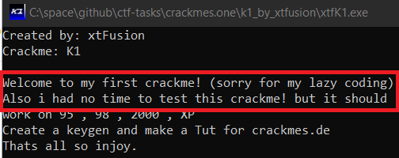
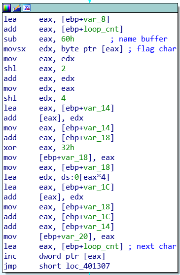
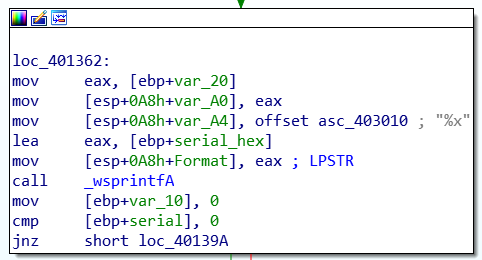
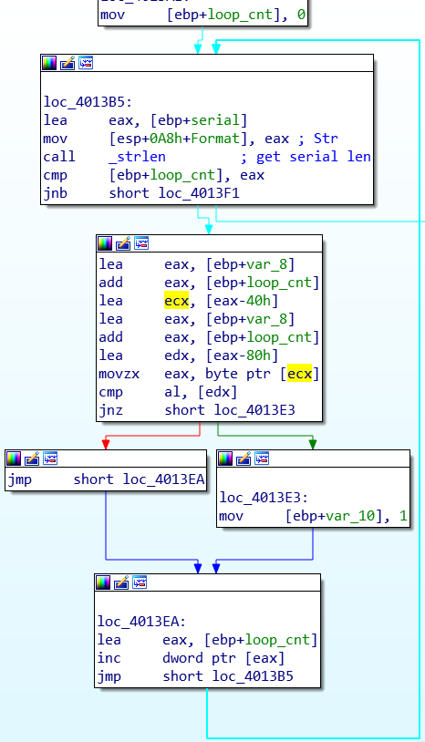
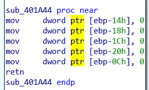
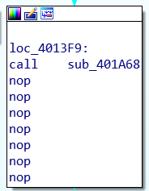
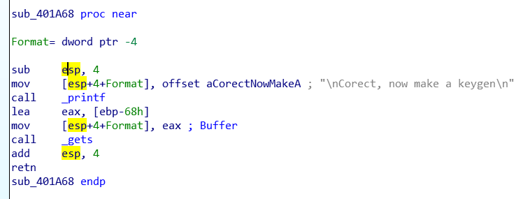
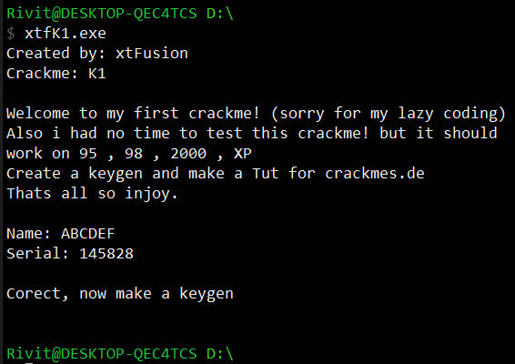

[Challenge](https://crackmes.one/crackme/5ab77f5333c5d40ad448c0d8)

## Solution
After some debugging it turned out that the challenge was broken... Author didn't test it properly:

Some variables are not zeroed at program startup and they are used as buffer (we add values to them), so every run of crackme will give different values, so sweet.
Let's jump into IDA (this time free version of it) and reverse algorithm

We see that var_14, var_18, var1C are used without initialization (we will patch this later). Next step is `var_14 += (flag_char << 2) + flag_char) << 4` which is equal to `var_14 += flag_char * 80`. Next steps: `var_18 = (var_18 + var_14) ^ 0x32`, `var_1C += var_18 * 4` and finally: `var_20 = var_14 + var_18 + var_1C`

`var_20` is converted into hex form using wsprintfA function and next step is comparing hex form with provided serial.

This is simple loop comparing characters of hex form and our serial. Keygen is in [keygen](./keygen.py) file. Running keygen: `python keygen.py name`

Now it's time to patch binary. We want to set `var_14`, `var_18` and `var_1C` to zero at the beginning of the program. We have to detour code flow to some function which will zero variables and return.
Also, we need to add `gets` function at the end of the program because it's closing immediately after solving (on Windows 10).

Let's place our code at the end of the .text section. There is 0x1BC bytes of space, which is enough for my purposes. I'm using [IDA keypatch](https://github.com/keystone-engine/keypatch) for patching.

Left patched, right original:

 

 

and after testing keygen and crackme, I got:

NOTE: crackme does not shut down immediately after solving on Windows 7, so probably something changed in API in Windows 10.
