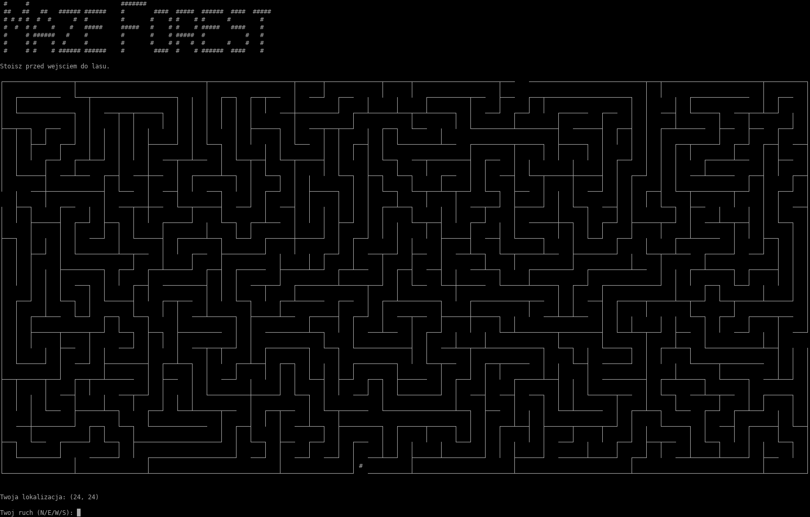

# Różdżka chaosu, Las, programming

## Opis
"Wejście do lasu znajduje się pod adresem: telnet://kctf.rozdzka.securing.pl:30000 Czy wiesz już, które wyjście prowadzi do różdżki?"

## Rozwiązanie

Po połączeniu się do serwera ukazuje się następujący widok:

więc zadanie jest proste - należy wyjść z labiryntu. Z zadania "Stary hazardzista", wiemy, że należy iść na wschód. Po próbuie manualnego rozwiązania okazało się, że zostajemy rozłączeni po jakimś czasie, więc trzeba napisać skrypt, który przejdzie labirynt za nas. Głównym wyzwaniem było parsowanie labiryntu tak, aby przekształcić go do postaci grafowej i wykorzystać algorytm rozwiązujący labirynt [Labyrinth Algorithms](http://bryukh.com/labyrinth-algorithms/).

W celu przekształcenia graficznej reprezentacji labiryntu do postaci grafowej, będziemy iterować po każdym wierszu labiryntu co drugi znak i w zależności od tego oznaczać czy jest to ściana czy wolne pole. Warto zauważyć, że takie przekształcenie "rozciągnie" labirynt dwukrotnie, ponieważ w oryginalnym labiryncie ściany de facto nie zajmują komórki, więc po rozwiązaniu trzeba będzie wykonywać co drugi ruch.

Następnie zostały wykorzystane funkcje `maze2graph` oraz `find_path_dfs` z wcześniej wspomnianej strony.

Po uruchomieniu [solvera](./solve.py) otrzymujemy flagę (WOC{SSSSSNAKESSSSS}) oraz sporo [danych](./based.txt), które są zakodowane w postaci base64. Po odkodowaniu okazuje się, że jest to plik .apk, który potrzebny jest do zadań z kategorii mobile.

